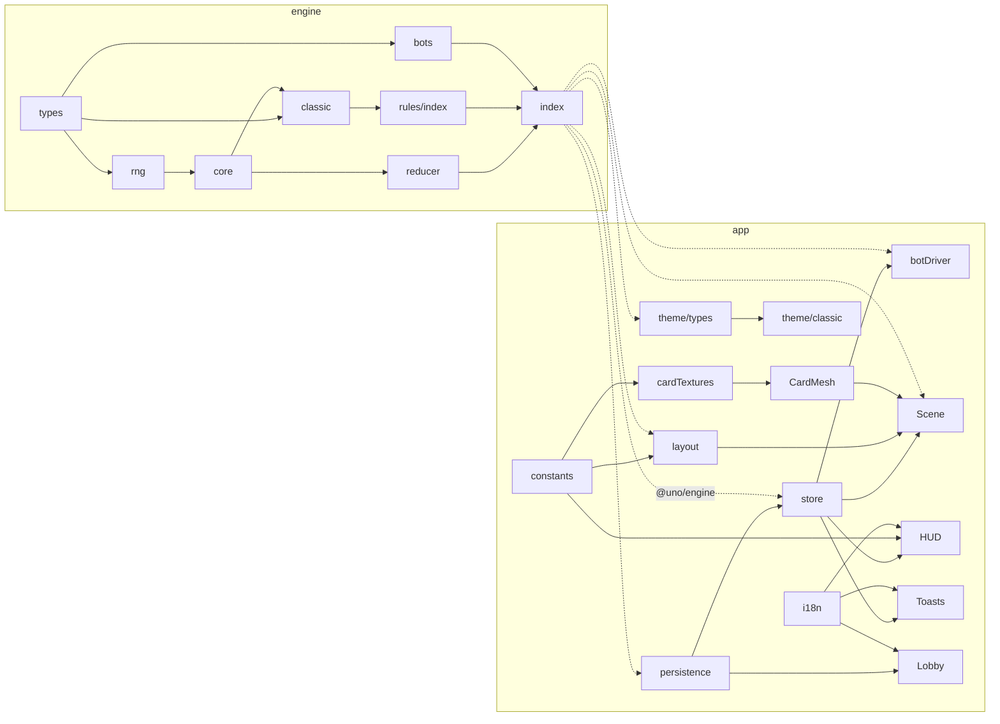

# 架構審計報告

**日期**：2026-09-10 23:07
**項目**：uno-games
**審計員**：Architect Agent（主導）+ Code Reviewer Agent（代碼層）
**審計範圍**：完整 codebase（`packages/engine`、`packages/app`、`scripts/`）
**方法**：全部 46 個 git-tracked 檔案逐一讀取；`pnpm test`、`test:cov`、`build`、`typecheck`、`pnpm audit`、`pnpm outdated`、`madge --circular` 均為實跑輸出。

---

## 項目概覽

- **類型**：純 client-side Web App（Vite SPA）+ 純 TypeScript 規則引擎。無 backend、無 HTTP API、無 database。
- **狀態**：Active — Milestone 1（Classic variant）完成。
- **估計代碼規模**：46 個 git-tracked 檔案，約 3,350 行（源碼 + 測試）
  | 區域 | 行數 | 明細 |
  |---|---|---|
  | Engine source | 1,322 | types 377 / reducer 421 / core 128 / rng 48 / rules/classic 169 / rules/index 6 / bots 161 / index 12 |
  | Engine tests | 719 | classic.spec 501 / bots.spec 89 / helpers 129 |
  | App source | 1,264 | scene 556 / theme 220 / ui 208 / store 105 / botDriver 84 / persistence 41 / i18n 15 / App+main 35 |
  | App CSS / JSON | ~260 | styles.css / en.json / manifest.json / manifest.schema.json |
  | Scripts | 49 | `scripts/smoke.mjs` |
- **最後活躍**：2026-09-10（4 個 commits，全部同日；`92cc8bb` merge PR #1）
- **Branch**：只有 `main`，無 `develop`

---

## Tech Stack

| 層級 | 技術 | 聲明版本 | 安裝版本 | 備注 |
|------|------|------|------|------|
| Runtime | Node / pnpm workspace | 無 `engines` / `packageManager` | Node 25.9.0 / pnpm 10.33.4 | 無 `.nvmrc`，版本未鎖 |
| Language | TypeScript | `^5.6.0` | 5.9.3 | `strict` + `exactOptionalPropertyTypes` + `noUncheckedIndexedAccess` + `noUnusedLocals/Parameters` |
| Engine deps | 零 runtime deps | — | — | ✅ 只有 devDependencies |
| Frontend | React / react-dom | `^18.3.1` | 18.3.1 | |
| 3D | three / @react-three/fiber / drei | `^0.169.0` / `^8.17.10` / `^9.114.0` | 0.169.0 / 8.18.0 / 9.122.0 | drei 只用 `Html` |
| State | zustand | `^5.0.0` | 5.x | |
| Build | Vite + @vitejs/plugin-react | `^5.4.8` / `^4.3.2` | 5.4.21 / 4.7.0 | `build.target: es2022`，`server.host: true` |
| Backend / DB / Cache / Queue | 無 | — | — | 純 client-side |
| 測試框架 | Vitest + @vitest/coverage-v8 | `^2.1.0` | 2.1.9 | 只有 engine；app 無測試 |
| Asset validation | ajv-cli | `^5.0.0` | — | `validate:assets` script |
| E2E | Playwright（global install） | — | — | `scripts/smoke.mjs`，唔喺 `package.json` |
| Infra / DevOps / CI / Lint | 無 | — | — | 無 `.github/`、無 ESLint / Prettier |

---

## 目錄結構

```
uno-games/
├── CLAUDE.md, README.md               項目規則 + 佈局說明
├── .claude/settings.json              ai-dev-team plugin 聲明
├── package.json, pnpm-workspace.yaml  root scripts: test / typecheck（pnpm -r）
├── scripts/smoke.mjs                  Playwright headless smoke（portrait → 6 turns → landscape）
├── packages/engine/                   純 TS 規則引擎，零 deps，無 DOM
│   ├── src/types.ts                   所有 contracts：State / Action / Event / RulePlugin / PublicView / Bot / Engine
│   ├── src/reducer.ts                 createEngine(registry)：apply / replay / getLegalMoves / getPublicView
│   ├── src/core.ts                    reducer 同 plugin 共用純 helpers（drawCards / skipPlayer / nextPlayerId…）
│   ├── src/rng.ts                     mulberry32 immutable PRNG，rngForTick(seed, tick)
│   ├── src/rules/classic.ts           Classic plugin：108 卡 deck、isLegal、onCardPlayed、cardPoints
│   ├── src/rules/index.ts             RULE_REGISTRY（只有 classic）
│   ├── src/bots/index.ts              easy / medium / hard heuristic bots，只食 PublicView
│   ├── src/index.ts                   public barrel + 預組裝 engine 實例
│   └── test/                          classic.spec (42) / bots.spec (6) / helpers.rig()
└── packages/app/                      Vite + React 18 + R3F
    ├── src/store/gameStore.ts         Zustand：包 engine.apply，保存 actionLog + stamped events
    ├── src/game/botDriver.ts          唯一 game timing 層：bot delay、human UNO timer、bot catch roll
    ├── src/scene/                     R3F：Scene / CardMesh / layout(state→CardTarget[]) / cardTextures / constants
    ├── src/ui/                        DOM HUD / Lobby / Toasts
    ├── src/theme/                     card asset 合約（types + classic face→atlas cell）— 目前無人 import
    ├── src/persistence/settings.ts    localStorage settings + stats（stats 從未寫入）
    ├── src/i18n/                      t(key, params)，只有 en.json
    └── public/assets/cards/           manifest.json + JSON schema（KTX2 atlas 合約；貼圖檔未存在）
```

---

## 架構分析

### 整體架構模式

實際情況同 CLAUDE.md 描述一致：**event-sourced pure engine + thin imperative shell + projection UI**。

- Engine：`apply(state, action) → { state, events }`（`reducer.ts:361`），state 全 `readonly`，每個 handler 用 spread 產新物件。`replay(config, seed, actions)` 係 fold（`reducer.ts:415-418`）。
- Shell：`gameStore.dispatch` 係唯一寫入口（`gameStore.ts:68-80`），append `actionLog`，stamp events 以 `seq` 讓消費者 idempotent。
- Timing：`botDriver.ts` 一個 `useEffect` 響應 state 變化，用 `setTimeout` 排程 bot action / UNO timeout（`botDriver.ts:62-83`）。
- Projection：`layout.ts:computeLayout` 純函數 `GameState → CardTarget[]`；`CardMesh.useFrame` lerp 去 target。
- 隨機性：engine 只用 `rngForTick(seed, tick)`；app 只喺 `newGame` 揀 seed 時用 `Date.now ^ Math.random`（`gameStore.ts:56`），之後 bot 隨機全部 `rngForTick(state.seed, state.tick)`（`botDriver.ts:42,47`）。

### 模組職責

| 模組 | 職責 | 邊界評語 |
|---|---|---|
| `engine/types.ts` | 所有 contract SSoT | 清晰；已預留 Flip（`Card.back`、`activeSide`、`SideFlipped`）、Teams（`PlayerConfig.team`）、Liar（`variantState`、`VARIANT` action/event） |
| `engine/reducer.ts` | 通用回合流程、phase 機、UNO、+4 challenge、計分 | 無 variant 名，但內嵌 Classic 假設（見 R7、AU-001） |
| `engine/core.ts` | 純 helpers | 良好；`drawCards` 自行處理 reshuffle + tick bump |
| `engine/rules/classic.ts` | deck、legality、card effects、points | module-level mutable `cardSeq`（`:41`），每次 `buildClassicDeck` reset，determinism 無損 |
| `engine/bots` | 決策，input 只有 `PublicView` + `LegalMove[]` + `Rng` | 邊界正確；heuristics hardcode Classic kinds（`bots/index.ts:90`） |
| `app/store` | engine wrapper + log | 良好；`actionLog` 只寫不讀 |
| `app/game/botDriver` | 唯一 game timer | 良好 |
| `app/scene` | 投影 + pointer input | 良好；直接用 `scene/constants.PALETTE`，唔經 `theme/` |
| `app/theme` | asset 合約 | **dead code**：`buildClassicTheme`、`cellToUv`、`assetUrl` 無 consumer；manifest 從未 fetch |
| `app/ui` | DOM HUD | 良好；`HUD.tsx:7` 重複定義 `UNO_CALL_MAX_HAND = 2`（同 `reducer.ts:48`） |
| `app/persistence` | localStorage | 無 schema validation、無 migration |
| `app/i18n` | `t()` | `setLocale` 從未調用；只有 en |

### 依賴關係



- **無循環依賴**（`madge --circular` 26 files 零命中；engine 同 app 各自係 DAG）。
- **Engine 零 import 來自 app / theme / React / DOM**。
- app → engine 係唯一跨 package 方向，全部經 `@uno/engine` barrel。
- `theme/` 係孤島：無人 import 佢。

### CLAUDE.md 7 條 Architecture Rules 驗證

| # | 規則 | 結論 | 證據 |
|---|---|---|---|
| R1 | Engine pure：無 `Date` / `Math.random` / timers | ✅ | grep `Date\|Math.random\|setTimeout\|setInterval\|performance.now\|window\|document\|process.` 喺 `packages/engine/src` 零 API 命中（只有註釋文字「challenge window」）。Replay spec 通過（`classic.spec.ts:438-455`、`bots.spec.ts:67-70`）。 |
| R2 | Reducer ↔ Plugin turn-flow contract | ✅ | (a) 先移卡 + 設 `activeColor` 再叫 plugin：`reducer.ts:239-246` → `:258`。(b) skip = plugin 設 `currentPlayer` 為被 skip 者 + `TurnSkipped`：`core.ts:119-124`；reducer 之後 `advanceTurn` 一步（`:97-103`）。(c) phase 非 `playing` 唔 advance：`reducer.ts:260`；follow-up 經 `finishPlay`：`:304,319,327,332`；空手即結束 round：`:107-108`。(d) Opening card 當 dealer 打出：`:211-212`。四點全有 spec 覆蓋。 |
| R3 | Bots 只見 `PublicView` | ✅ | `Bot.decide(view: PublicView, legal, rng)`（`types.ts:361`）；唯一 call site `botDriver.ts:40-42`；`bots/index.ts` 無 import `GameState`；`getPublicView` 唔 expose `cards` map / 他人 hand / seed。但 `draw4Challenge.wasBluff` 有洩漏（AU-006）。 |
| R4 | 所有 timing 喺 `botDriver.ts` | ⚠️ | Game timing ✅ 全部喺 `botDriver.ts:13-16,67,81`。另有 `Toasts.tsx:40` 一個 UI 裝飾 `setTimeout`（1800ms，唔影響 game state）。建議 CLAUDE.md 註明「game timing」以免歧義。 |
| R5 | Scene 純投影，無 game logic | ✅（小瑕疵） | `layout.ts:128-146` 純函數；`Scene.tsx:87` 經 engine `legalMovesForHuman` 判斷合法性。瑕疵：`Scene.tsx:71` hardcode 英文字串（C-001）；`HUD.tsx:7` 重複 UNO 常數（W-006）。 |
| R6 | Theme 隔離，engine 唔 import theme | ✅（但 theme 未接線） | engine 無 import theme。但 scene 實際用 `scene/constants.ts:48-56 PALETTE` + `cardTextures.ts` canvas placeholder；`theme/` 同 manifest 未被 runtime 讀取。IP swap 而家要改 `scene/`，唔係 `theme/`（AU-004）。 |
| R7 | Variant = plugin + theme + specs；reducer 無 special-case | ⚠️ | reducer 無 variant 名 ✅。但內嵌 Classic 假設：`.front` hardcode（`:184,192,235,387`）、`requiresColor = color === 'wild'`（`:387`）、`pendingDraw` 於 plugin 前被清（`:244`）、UNO 判定於 plugin 前（`:249-252`）、`isRoundOver?` hook 聲明但從未調用。詳見 AU-001、AU-002、Roadmap 擴展性。 |

---

## API 結構（本項目對應：Engine 介面）

本項目無 HTTP API。以下係 engine public surface。

### Public surface（`engine/src/index.ts`）

| Export | 類型 | 用途 |
|---|---|---|
| `engine` | `Engine`（預組裝，registry = `RULE_REGISTRY`） | app 直接用 |
| `createEngine(registry)` | factory | 測試 / 自訂 registry |
| `Engine.createInitialState(config, seed)` | | phase `lobby` |
| `Engine.apply(state, action)` | `→ { state, events }` | 唯一 mutation 入口 |
| `Engine.getLegalMoves(state, player)` | `→ LegalMove[]` | 非該玩家回合 / 非 `playing` → `[]` |
| `Engine.getPublicView(state, player)` | `→ PublicView` | bots / 未來 remote client |
| `Engine.replay(config, seed, actions)` | `→ GameState` | fold；丟棄 events |
| `createRng`, `rngForTick` | | app botDriver 用 |
| `createBot(difficulty)` | `→ Bot` | |
| `RULE_REGISTRY`, `classicRules`, `buildClassicDeck`, `CLASSIC_DECK_SIZE`, `core.*` | | 供未來 plugin 用 |

### Action 表

| Action | 觸發者 | 前置 phase / 條件 | 產生 events（成功時） | Handler |
|---|---|---|---|---|
| `START_GAME{players}` | app `newGame` | `lobby`；2–4 人 | `GameStarted` | `reducer.ts:142` |
| `START_ROUND` | app / HUD "Next round" | `round_over` | `RoundStarted`, `CardsDealt`×N, `DiscardStarted`, opening 效果, `TurnChanged` | `:158` |
| `PLAY_CARD{player,card,chosenColor?}` | human / bot | `playing` + 自己回合 + 卡喺手 + 若有 `drawnCard` 只可打該卡 + `plugin.isLegal` | `CardPlayed`, plugin events, `TurnChanged` 或 `RoundEnded`(+`GameEnded`) | `:226` |
| `DRAW_CARD{player}` | human / bot | `playing` + 自己回合 + 未 draw | `CardDrawn(turn)`, [`DrawPileReshuffled`], 若不可打 → `TurnChanged` | `:263` |
| `PASS{player}` | human / bot | 已 draw 到可打卡 | `TurnChanged` | `:282` |
| `CHOOSE_COLOR{player,color}` | human / bot | `choosing_color` + currentPlayer | `ColorChosen` → `playing` / `challenge_window` | `:289` |
| `CHALLENGE_DRAW4{player}` | target | `challenge_window` | `Draw4Challenged{succeeded}`, `CardDrawn(challenge)`, [`TurnSkipped`], `TurnChanged`/`RoundEnded` | `:306` |
| `ACCEPT_DRAW4{player}` | target | `challenge_window` | `CardDrawn(draw4)`, `TurnSkipped`, `TurnChanged`/`RoundEnded` | `:306` |
| `CALL_UNO{player}` | human / bot | 非 lobby/round_over/game_over；手牌 1–2；未 call | `UnoCalled` | `:334` |
| `CATCH_UNO{player,target}` | human / bot / botDriver | `unoVulnerable === target` 且非自己 | `UnoCaught`, `CardDrawn(uno_missed, 2)` | `:344` |
| `TIMEOUT{player}` | botDriver | `unoVulnerable === player` | 無 | `:351` |
| `VARIANT{player,payload}` | 未來 variant | 交 `plugin.onVariantAction`；Classic → `ActionRejected(variant_rule)` | plugin 決定 | `:373` |

所有失敗 → `ActionRejected{action, reason}`，**state 原物件返回**（`:87-89`，唔 bump tick）。

### Event 表（`types.ts:242-261`）

`GameStarted`, `RoundStarted`, `CardsDealt`, `DiscardStarted`, `CardPlayed`, `CardDrawn{reason}`, `DrawPileReshuffled`, `ColorChosen`, `DirectionReversed`, `TurnSkipped`, `TurnChanged`, `UnoCalled`, `UnoCaught`, `Draw4Challenged`, `SideFlipped`（聲明，無 emitter）, `RoundEnded{points,scores}`, `GameEnded`, `ActionRejected`, `Variant`（聲明，無 emitter）。

App 消費者：`Toasts.tsx:11-24` 只讀 7 種；scene 唔讀 events，純靠 state diff lerp（符合 CLAUDE.md）。

---

## 數據庫結構（本項目對應：State Shape + Persistence）

### `GameState`（`types.ts:179-216`）

| 欄位 | 類型 | 說明 / 由邊個寫 |
|---|---|---|
| `config` | `RuleConfig{variant, houseRules, targetScore, unoCallWindowMs}` | 建立後不變 |
| `seed`, `tick` | `number` | tick 每個成功 action bump + reshuffle 額外 bump |
| `phase` | 7-literal closed union | reducer |
| `players[]` | `{id, hand: CardId[], calledUno, score}` | reducer / plugin |
| `playerConfigs[]` | `{id, name, kind, difficulty?, team?}` | START_GAME |
| `currentPlayer`, `direction` | | reducer + plugin |
| `cards` | `Record<CardId, Card>` — 唯一 card 實體 | START_ROUND |
| `drawPile`, `discardPile` | `CardId[]`（discard 尾 = top） | |
| `activeSide`, `activeColor` | Flip / Wild | reducer 每 round reset `front` |
| `pendingDraw?` | `{amount, source}` | 只有 classic +4 設；reducer 每次 play 清；**無 consumer 讀取** |
| `unoVulnerable?`, `drawnCard?`, `draw4Challenge?`, `openingWild?` | 轉場 context | reducer |
| `round`, `roundWinner?`, `gameWinner?` | | |
| `variantState?` | `Record<string, unknown>` | 預留，無人用 |

### `PublicView`（`types.ts:335-352`）

`me`, `myHand: Card[]`, `players[]{id, handCount, calledUno, score}`, `currentPlayer`, `direction`, `topCard`, `activeColor`, `activeSide`, `drawPileCount`, `discardHistory: Card[]`, `phase`, `pendingDraw?`, `unoVulnerable?`, `drawnCard?`, `draw4Challenge?`, `houseRules`。

無洩漏：無 `cards` map、無他人 hand、無 `seed`、無 `playerConfigs`。**例外**：`draw4Challenge.wasBluff` expose 畀 target（AU-006）。

### Persistence（`app/src/persistence/settings.ts`）

| 項目 | 現況 |
|---|---|
| 存儲 | `localStorage`，keys `uno.settings.v1`、`uno.stats.v1` |
| 存乜 | `Settings{opponents, difficulty, unoCallWindowMs}`；`Stats{gamesPlayed, gamesWon, roundsWon}` |
| 版本化 | 只靠 key 後綴 `.v1`；`read()` shallow merge，無 schema / range validation，無 migration |
| Stats | `saveStats` / `loadStats` 從未被調用 |
| 遊戲存檔 | **無**。`actionLog` + `seed` 只喺 memory；reload 即失局。`replay` API 無 caller |
| 錯誤處理 | try/catch 包住 get/set ✅ |

### 關係圖（文字描述）

`GameState.cards` 係唯一 card 實體表；`players[].hand`、`drawPile`、`discardPile` 全部係 `CardId` 引用（1 card : 1 位置，card conservation 由 `bots.spec.ts` 驗證）。`playerConfigs[i].id` ↔ `players[i].id` 一對一。`PublicView` 係 `GameState` 對單一 player 嘅投影（N:1）。

---

## 測試驗證結果（Code Reviewer 實跑）

| 命令 | 結果 | 備註 |
|------|------|------|
| `pnpm test` | ✅ 48/48 pass（classic.spec 42 + bots.spec 6） | Vitest 2.1.9，1.7s |
| `pnpm --filter @uno/engine test:cov` | ✅ Lines **99.7%** / Stmts 99.7% / Funcs **100%** / Branch **93.04%** | CLAUDE.md「line ≥ 99%」屬實。未覆蓋：`classic.ts:127`（default throw）、`bots/index.ts:136`（PASS 分支）、`core.ts` branch 29/49/54/99 |
| `pnpm --filter @uno/app build` | ✅ tsc + vite build 通過 | ⚠ 單一 chunk 999 kB（gzip 278 kB），three.js 未 code-split |
| `pnpm typecheck` | ✅ engine + app | strict 全開 |
| App 測試 | ❌ 缺失 | `packages/app` 無任何 spec；`smoke.mjs` 手動 Playwright，唔喺 `pnpm test` 內 |
| Lint / Prettier config | ❌ 缺失 | 無 eslint / prettier config、無 `lint` script |
| 循環依賴 | ✅ 零 | `madge --circular` |
| TDD 證據（SK-004） | ⚠ 無法驗證 | 只有 1 個 feature commit，src + test 一齊 commit |
| `pnpm audit` | ⚠ 8 vulns（1 critical / 2 high / 5 moderate） | **全部 devDependencies**（vitest UI server、fast-json-patch via ajv-cli、vite fs.deny、esbuild）；runtime deps 零命中 |

### 邏輯抽查（Classic vs Mattel 官方規則）

| 規則 | 實現位置 | 狀態 | Spec 覆蓋 |
|------|----------|------|-----------|
| Opening = Wild Draw Four → 重洗重抽 | `reducer.ts:182-189` | ✅ | `classic.spec.ts:44-49`（200 seeds） |
| Opening = Wild → dealer 左手邊揀色 | `reducer.ts:214-218, 296-299` | ✅ | `:469-478` |
| Opening = Reverse → dealer 先出、方向反轉 | `reducer.ts:219-222` | ✅ | `:480-484`（3 人）；**2 人局 opening Reverse 未覆蓋** |
| Opening = Skip / Draw Two | `classic.ts:95-96,108-111` | ✅ | `:486-495` |
| 兩人局 Reverse = Skip | `classic.ts:104-105` | ✅ | `:158-164` |
| WD4 合法性 = 手上無當前顏色 | `classic.ts:121` | ✅ | `:202-209, 237-246` |
| WD4 challenge 成功 / 失敗（抽 4 / 抽 6 + skip） | `reducer.ts:321-331` | ✅ | `:237-255` |
| WD4 / Draw Two 為最後一張仍先罰抽再結束 | `reducer.ts:318,326,331` | ✅ | WD4 `:257-266`；**Draw Two 為最後一張未覆蓋** |
| 抽牌後不可出 → 結束回合；可出 → 出或 PASS | `reducer.ts:275-279, 231` | ✅ | `:276-302` |
| Reshuffle 保留 discard top | `core.ts:98-107` | ✅ | `:304-314` |
| 牌疊 + 棄牌堆同時耗盡 → 唔 crash | `core.ts:99` | ✅ | **未覆蓋** |
| UNO 漏叫罰 2；下一位行動後窗口關閉 | `reducer.ts:249-251,130-136,347` | ✅ | `:329-370` |
| UNO 窗口喺下一位 `CHOOSE_COLOR` / `ACCEPT_DRAW4` / `CHALLENGE_DRAW4` 唔關閉 | `reducer.ts:289-332` 無 call `clearUnoVulnerabilityFor` | ⚠ **疑點**：P0 出 WD4 剩 1 張漏叫 → P1 accept 後窗口仍開到 P2 出牌，同官方「before the next player begins their turn」有出入 | **未覆蓋** |
| 計分 / target score / dealer 輪換 / replay byte-for-byte | `reducer.ts:111-128,162,414-418` | ✅ | `:395-454` |
| `pendingDraw` 設定但無 consumer | `classic.ts:138` set；無讀取 | ⚠ 未確認用途（可能為 stacking 預留） | n/a |

---

## 發現問題

> 架構級用 `AU-NNN`（Architect），代碼級用 `C/W/S-NNN`（Code Reviewer，按 sw-ticket-management 全局唯一）。

### 🔴 Critical（架構級問題，必須處理）

#### [AU-001] Reducer 內嵌 Classic 假設，阻塞 roadmap 4 個 variant
- **位置**：`packages/engine/src/reducer.ts:244`（清 `pendingDraw`）、`:249-252`（UNO 判定先於 plugin）、`:184,192,235,387`（`.front` hardcode）、`:387`（`requiresColor`）；`packages/engine/src/core.ts:37-42`（`nextPlayerId` 無淘汰概念）
- **描述**：reducer 雖無 variant 名，但 turn-flow 有多處只對 Classic 成立嘅 hardcode。
- **影響**：No Mercy（stacking、mercy rule、discard all）、Flip（side）、All Wild（colour choice）、Teams（round-over）無法純靠 plugin 實現，會逼使 plugin hack 或 reducer special-case（違反 R7）。
- **建議**：見「建議方向」方案 B 第 1–6 點；每點一個 PR，配 spec。

#### [AU-002] `isRoundOver?` hook 聲明但 reducer 從未調用
- **位置**：`packages/engine/src/types.ts:321` 聲明；`packages/engine/src/reducer.ts:107-109` `finishPlay` 只檢查 `hand.length === 0`
- **描述**：Teams 依賴呢個 hook；plugin 實作咗都無效，屬 silent contract 缺口。
- **影響**：Teams 無法結束 round；開發者按 interface 寫 hook 會以為生效。
- **建議**：`finishPlay` 改為 `plugin.isRoundOver?.(state) ?? (hand empty ? player : undefined)`，加 spec 確認 hook 被調用。

#### [C-001] 用戶可見字串 hard-coded，違反 CLAUDE.md i18n 規則
- **位置**：`packages/app/src/scene/Scene.tsx:71`（`' · UNO'`、`' · tap to catch!'`）；`packages/app/src/store/gameStore.ts:14,41,45`（`BOT_NAMES`、`` `Bot ${i}` ``、`name: 'You'`）
- **描述**：`playerName()` 回傳嘅 `'You'` 直接出現喺 `HUD.tsx:99` 同 `Toasts.tsx:12`；`en.json` 已有 `player.you` 但只有 `ScoreBar` 用。
- **影響**：換語言 / IP swap 時字串唔跟住變；同一個「You」有兩個來源。
- **建議**：`Scene.tsx` 改用 `t('scene.uno')` / `t('scene.tapToCatch')`；`playerName()` 對 `HUMAN_ID` 回傳 `t('player.you')`，bot 名改 `t('bot.name.N')`。

#### [C-002] `localStorage` settings 未驗證即餵入 engine → HUD crash（= AU-007）
- **位置**：`packages/app/src/persistence/settings.ts:21-28` → `gameStore.ts:39,64` → `reducer.ts:145` → `HUD.tsx:31`
- **描述**：`opponents` 被改成非 1–3 值 → `START_GAME` 被 reject → `state` 非 null 但 `players` 為空 → `HUD.tsx:31` `find(...)!` TypeError 白屏，無 recovery。`difficulty` 非法時 `UNO_FORGET_CHANCE[difficulty]` 為 `undefined`，bot 永不叫 UNO（靜默降級）。
- **影響**：本地 tamper / 舊 schema 殘留即可令 app 白屏。
- **建議**：A) `read()` 加 type guard，非法即 `DEFAULT_SETTINGS`；B) `newGame` 遇 `ActionRejected` 就 `reset()` 返 lobby。推薦 A + B。

### 🟡 Warning（設計問題，建議處理）

#### [AU-003] Bot 產生被拒 action 會令遊戲靜默停頓（無 watchdog）
- **位置**：`reducer.ts:87-89`（reject 返回同一 state 物件）；`gameStore.ts:73-78`；`botDriver.ts:59,83`（deps `[state, dispatch]`）
- **描述**：bot action 被 reject → state reference 不變 → selector 唔 re-render → effect 唔重跑 → 永久等待。目前靠 25-seed spec 保證 Classic 唔發生；新 variant / bot 一有 bug 就 freeze，無提示。
- **建議**：botDriver 讀 `dispatch` 返回 events，見 `ActionRejected` 時 fallback（DRAW / PASS）並 log；store 對 rejected action 唔 append 入 `actionLog`。

#### [AU-004] Theme 層完全未接線，IP-swap 隔離（R6）只係紙上合約
- **位置**：`packages/app/src/theme/*`（零 consumer）；`scene/constants.ts:48-56 PALETTE`、`scene/cardTextures.ts`（實際視覺來源）；`HUD.tsx:3` import `PALETTE` 自 scene
- **影響**：IP swap 要改 `scene/`，唔係 CLAUDE.md 所講嘅 `theme/` + manifest。
- **建議**：先將 `PALETTE` 搬去 `theme/`；之後 loader 讀 manifest → `CardTheme` → `CardMesh` 用 atlas UV。

#### [AU-005] `houseRules` 聲稱支援但零實作；設定無 UI
- **位置**：`classic.ts:161`（`supportedHouseRules` 列四項）；`gameStore.ts:59`（hardcode official）；`Lobby.tsx`（無 toggle）
- **描述**：唯一讀取係 `reducer.ts:403` pass-through 入 `PublicView`。應讀但冇讀：`stacking` → `playCard:244` + `drawCard:271` + `classic.isLegal`；`jumpIn` → `requireTurn:92-95`；`sevenZero` → `classic.onCardPlayed:92`；`forcePlay` → `drawCard:276-280` / `pass:282`。
- **建議**：短期將 `supportedHouseRules` 改 `[]`；實作時每項對應上述讀取點。

#### [AU-006] `PublicView.draw4Challenge.wasBluff` 洩漏隱藏資訊畀 bot
- **位置**：`reducer.ts:411`（原封 spread）；`types.ts:168-177`
- **影響**：目前 bots 唔讀（`bots/index.ts:113-117`），但未來 hard bot 順手讀咗就係作弊；阻礙 remote client 重用 PublicView。
- **建議**：`getPublicView` 對 `draw4Challenge` 做 `Omit<…, 'wasBluff'>`。

#### [AU-007] localStorage settings 無 validation（見 C-002）

#### [AU-008] R3F scene 每卡 6 draw calls + 全卡 castShadow，手機負載未量測
- **位置**：`CardMesh.tsx:16,30,66`；`Scene.tsx:134,138`
- **描述**：每張可見卡 = 1 `BoxGeometry` × 6 material groups → 開局約 40 張可見 ≈ **240 draw calls**，全部 `castShadow` + 1024² shadow map → shadow pass 再加一倍。`useMemo` 每 mount 建 2 個 material，unmount 無 `dispose()`。無 instancing、無 atlas。手機 FPS **未量測**。
- **建議**：單 material + atlas UV（AU-004 完成後自然可做）；考慮 `InstancedMesh`；shadows 只開 table / opponents；unmount `dispose()`。

#### [AU-009] Replay / 存檔能力有 API 無出口
- **位置**：`gameStore.ts:25,75`（`actionLog` 只寫；rejected action 亦 append）；無 game save；`engine.replay` app 零 caller
- **影響**：手機 reload / 切後台被殺 = 失局；QA 報 bug 無法附 seed + log。
- **建議**：`persistence/game.ts` 存 `{config, seed, actionLog, version}`；啟動時 `replay` 恢復；reject 時唔 append。

#### [W-001] 字面量比較（magic string）53 處
- **位置**：`reducer.ts` 14、`bots/index.ts` 12、`HUD.tsx` 7、`classic.ts` 6、`botDriver.ts` 5、其餘各 1–2
- **描述**：全部係 TS literal-union discriminant（`face.kind === 'number'`、`state.phase === 'playing'`），有 type-check 保護；project CLAUDE.md 只禁 magic number，所以降為 🟡 交 Architect 裁定。
- **建議**：為 `CardKind` / `Phase` / `CardColor` / event type 建 `as const` 物件；engine 未來 8 個 variant 會大量重複呢啲 literal。

#### [W-002] Magic default 值
- **位置**：`reducer.ts:78` `activeColor: 'red'`；`botDriver.ts:19,50` `?? 'medium'`（重複）；`test/helpers.ts:100`
- **建議**：`DEFAULT_ACTIVE_COLOR`、`DEFAULT_BOT_DIFFICULTY` 常數。

#### [W-003] Magic number 約 42 處，90% 集中喺 scene 層
- **位置**：`Scene.tsx:56,60,65,69,133,137,138,140`（geometry args、light、hex colours）；`layout.ts:67-108,123-124`（offset、FNV-1a 常數未命名）；`cardTextures.ts:55-118`；`CardMesh.tsx:17,27,28,40`；`bots/index.ts:73` `slice(-8)`；`rng.ts:47` `0x9e3779b9`
- **描述**：CLAUDE.md「Named constants only」。engine 層基本合規；scene 層大量違反。
- **建議**：抽去 `scene/constants.ts`（已有此檔，未用盡）。

#### [W-004] 函數超長（TS > 30 行）
- `reducer.ts:158-224` `startRound` **67 行**（deal + opening redraw + opening effect 三個職責）
- `bots/index.ts:102-158` `decide` **57 行**
- `rules/classic.ts:81-129` `onCardPlayed` 49 行
- `cardTextures.ts:59-102` `faceTexture` 44 行（同 `backTexture` 60% 重複）
- `reducer.ts:226-261` `playCard` 36 行；`core.ts:85-117` `drawCards` 33 行
- React 組件無超 50 行（`CardMesh` 剛好 50）
- **建議**：`startRound` 拆 `dealHands()` / `pickOpeningCard()` / `applyOpeningEffect()` 落 `core.ts`。

#### [W-005] `HUD.tsx` 一檔 7 個 component；無 component 目錄結構
- **位置**：`packages/app/src/ui/HUD.tsx`（ScoreBar、TurnBanner、ActionBar、ColorPicker、ChallengePrompt、RoundOver、HUD）
- **建議**：最少一檔一 component（`ui/hud/ScoreBar.tsx` …）。

#### [W-006] UI / bot 層重複 engine 業務規則（SK-006）
- **位置**：`HUD.tsx:7,33`、`bots/index.ts:126`、`reducer.ts:334-338` 三處各自定義「UNO 可叫嘅手牌上限 = 2」；`Scene.tsx:98` / `layout.ts:135` 重複 opponents filter；`Scene.tsx:52` / `layout.ts:77` 重複 seat yaw
- **影響**：engine 改規則（No Mercy）時 UI / bot silent drift。
- **建議**：engine export `canCallUno(state, player)` + `UNO_CALL_MAX_HAND`，UI / bot 統一用。

#### [W-007] `Toasts.tsx` effect 自我觸發，`TOAST_MS` timer 從未生效
- **位置**：`packages/app/src/ui/Toasts.tsx:32-42`
- **描述**：deps 含 `lastSeq`；effect 內 `setLastSeq()` → re-render → cleanup `clearTimeout` → 第二次 run 提早 return。Toast 只靠 CSS `animation: fade … forwards` 視覺隱藏，DOM node 一直留低。
- **建議**：`lastSeq` 改 `useRef`，唔放入 deps。

#### [W-008] `unoCallWindowMs = 0` 語意同 type 註解不符（= AU-013）
- **位置**：`types.ts:133`「0 = no timer (auto-call)」vs `botDriver.ts:66-72` `setTimeout(…, 0)` 即刻 catch roll
- **建議**：botDriver 遇 0 時自動 dispatch `CALL_UNO`。

#### [W-009] Non-null assertion `!` 共 46 處，3 處有實際風險
- **位置**：`HUD.tsx:31` `players.find(...)!`（C-002 可 crash）、`bots/index.ts:114` optional chain 後再 `!`、`HUD.tsx:48` closure 內失去 narrowing
- **建議**：engine 加 `cardOf(state, id)` helper 集中 throw；UI 層改 early-return。

#### [W-010] 缺 ESLint / Prettier / lint script（= AU-014）
- **描述**：抽樣 `reducer.ts` / `HUD.tsx` / `layout.ts`：semicolon 一致、single quote 一致、**縮排 2 空格**（規範 4）、超 100 字元行 reducer 21 / HUD 14 / layout 9（最長 201）。無工具 enforce。
- **建議**：加 `.prettierrc` + `eslint.config.js`（typescript-eslint + react-hooks）+ root `lint` script；決定 tabWidth 後一次過 format。

#### [W-011] `packages/app` 零自動化測試
- **描述**：`layout.ts`、`botDriver` 嘅 `pendingBot` / `humanCaughtBy`、`settings.read`、`i18n/t()`、`cellToUv` 全係 pure function，極易測但無 spec。`smoke.mjs` 依賴英文字串 `'Play'` / `'Draw'`。
- **建議**：app 加 vitest（先測 pure module）；smoke 改用 `data-testid`。

### 🟢 Observation（可改善點）

- **[AU-010]** `Phase` union closed（`types.ts:154-161`），variant 無法新增等待狀態；Flex / Liar 需要通用 `awaiting_choice` phase + plugin `pendingPrompt(state)`。
- **[AU-011]** Bots variant-unaware：`bots/index.ts:90` attack kinds hardcode；`Bot.decide` 只收 `LegalMove[]`，VARIANT action 無法被 bot 發現。建議 plugin 提供 `cardTraits(kind)`、`legalVariantActions(view)`。
- **[AU-012]** `CardKindExt` 係 open string（`types.ts:65`），打錯字 `'draw_6'` vs `'draw6'` compiler 唔捉。建議 `RulePlugin<K extends string>` generic 或每 variant `as const` KINDS。
- **[AU-013]** = W-008。
- **[AU-014]** 無 CI、無 lint、無 Node 版本鎖；R1/R6 邊界無 lint rule 守（可用 `no-restricted-imports` 或 dependency-cruiser）。
- **[AU-015]** `PublicView` 未 expose `playerConfigs.kind` / 淘汰狀態；bot 唔知對手係人。隨 AU-001 一齊補。
- **[AU-016]** devDependencies 1 critical / 2 high audit 命中（vitest 2.1.9 UI server、fast-json-patch via ajv-cli、vite 5.4.21 fs.deny、esbuild）。只影響 dev / test；但 `server.host: true` 令 dev server 對 LAN 開放。建議升 vite ≥ 6.4.3 / vitest ≥ 3；`ajv-cli` 換 `ajv` script。
- **[S-001]** Dead exports 9 個：`loadStats` / `saveStats`、`selectState` / `selectIsHumanTurn`、`setLocale`、`TWO_STEPS`、`buildClassicTheme` / `cellToUv` / `assetUrl` / `CARD_ASPECT_RATIO`（theme 係 milestone 2 預留，應標明）。Dead i18n keys：`hud.score`、`variant.flip`。
- **[S-002]** i18n 自製 flat `t()`（15 行），非 react-i18next；CLAUDE.md 明文接受，屬有意識選擇。
- **[S-003]** `reducer.ts:398` `state.activeColor as CardColor` 冗餘 cast。
- **[S-004]** `cardTextures.ts:66-80` vs `110-123` 重複約 20 行，可抽 `drawCardFrame()`。
- **[S-005]** Bundle 999 kB 單 chunk；`vite.config.ts` 加 `manualChunks` 分 three + drei vendor chunk。
- **[S-006]** Comments 質量良好：無 commented-out code、無 TODO/FIXME，多為 WHY comment。
- **[S-007]** Engine purity ✅ 零違規。
- Git flow：repo 只有 `main`，無 `develop`；global-rules 要求 branch checkout 自 `develop`。需決定係咪建立 `develop`，或喺 project CLAUDE.md 明文採用 single-trunk。

---

## Roadmap 擴展性評估（Architect）

### `RulePlugin` 現有 hooks（`types.ts:300-322`）

| Hook | 必須？ | Reducer 調用點 |
|---|---|---|
| `buildDeck(rng)` | 是 | `startRound:167` |
| `isLegal(state, player, card)` | 是 | `playCard:233`、`drawCard:277`、`getLegalMoves:387` |
| `onCardPlayed(state, player, card, chosenColor?)` | 是 | `playCard:258`、`startRound:212` |
| `cardPoints(card, side)` | 是 | `endRound:117` |
| `onVariantAction?` | 否 | `apply:374` ✅ |
| `isRoundOver?` | 否 | **零調用** — dead hook |

**缺少嘅 hooks**：turn-start / before-draw（stacking 結算）、after-draw（mercy rule）、after-effects（UNO 判定重算）、`needsColorChoice(card)`、`legalVariantActions(state, player)`（畀 bots）、round-end scoring override（Teams）。

### No Mercy 具體 gap

| 需求 | 現有 hook 夠唔夠 | Gap |
|---|---|---|
| 168 卡 deck + 新 kinds | ✅ `buildDeck` + `CardKindExt` + `cardPoints` | theme 需新 `faceToCell`；bots `isAttack` 唔識新 kinds |
| Stacking | ❌ | `reducer.ts:244` 喺 plugin **之前**清 `pendingDraw`；無 turn-start hook；`drawCard:271` 固定 draw 1 |
| Skip Everyone | ✅ | plugin 設 `currentPlayer = prev(player)`，需 emit 多個 `TurnSkipped` |
| Discard All | ⚠️ | `reducer.ts:249-252` UNO vulnerability 喺 plugin **之前**判定 → discard-all 後手牌變 1 唔會 vulnerable |
| 7-0 swap | ⚠️ | `calledUno` / `unoVulnerable` 換手後語義未定義 |
| Mercy rule（≥25 張淘汰） | ❌ | `PlayerState` 無 `eliminated`；`core.nextPlayerId` 遍歷所有人；`endRound` 計所有非 winner；無 after-draw hook |
| Bots 策略 | ❌ | 無 stacking 概念（有 pending +2 仍會 DRAW）；無 per-variant strategy 注入點 |

### 其他 variant 快速掃描

- **Flip**：`Card.back` / `activeSide` / `SideFlipped` / `cardPoints(card, side)` / `core.activeFace` / manifest `doubleSidedVariant` 已預留 ✅。未預留：`reducer.ts:184,192,235,387`、`bots/index.ts:51,74,148,149`、`Scene.tsx:106`、`test/helpers.ts:73-77,92` 全部 hardcode `.front`。
- **Teams**：有 `PlayerConfig.team?` + `isRoundOver?` 簽名。無：`PlayerState` 無 team；`endRound` / `gameWinner` / `RoundEnded.winner` 全 per-player；`finishPlay` 只檢查單人空手；scene `OPPONENT_SEATS` 無 partner 座位；HUD ScoreBar per-player。
- **Zero**：`onCardPlayed` 可做；同 `houseRules.sevenZero` 重複，建議 plugin 層 compose。
- **Liar**：`variantState` + `onVariantAction` 已接線；但 bot 無途徑知道有 VARIANT action。
- **All Wild**：`requiresColor = color === 'wild'`（`reducer.ts:387`）應交 plugin。
- **Flex**：`PLAY_CARD` 只有 `chosenColor` payload；`Phase` closed；需通用 `awaiting_choice`。

---

## 技術債評估

| 類別 | 程度 | 描述 | 預計處理成本 |
|------|------|------|-------------|
| 代碼質量 | 低 | Strict TS 全開；純函數為主；engine 層 named constants 守得好；檔案短小。瑕疵：theme/ dead code、HUD 重複常數、scene 層 magic number、6 個超長函數、無 lint | 1 天 |
| 測試覆蓋 | 中 | Engine 99.7% lines / 93.0% branch / 100% funcs，25 seeds × 3 難度 full-game 模擬。**App 0 tests**；smoke 靠 global playwright，無 CI | 1–2 天（app unit + CI） |
| 文件完整性 | 中 | CLAUDE.md、README、reducer/types header 質素高。缺：ADR、diagram（本次補）、`supportedHouseRules` 同實作不符、`unoCallWindowMs: 0` 註釋失真 | 0.5 天 |
| 安全性 | 低 | 純 client-side、無 secrets。`pnpm audit` 8 vulns 全部 devDeps。localStorage settings 無 validation（C-002） | 0.5 天 |
| 性能 | 中 | ~240 draw calls + 全卡 shadow + material 無 dispose + 999 kB 單 chunk。手機 FPS 未量測 | 1–2 天（atlas + instancing + dispose + chunk split） |
| 依賴更新 | 中 | React 18.3→19.3、R3F 8.18→9.7（需 React 19）、drei 9→10、three 0.169→0.186、vite 5→8、vitest 2→5、TS 5.9→7.0。無 `engines` / `.nvmrc` | 1 天 |

---

## 建議方向

### 方案 A：直接喺現有基礎上做 No Mercy
- **適用情況**：只想快速出下一個 variant，接受 plugin 內 workaround。
- **預計工作量**：2–3 天
- **優點**：唔碰 reducer，零 regression 風險。
- **缺點**：plugin 要繞過 reducer（自己 draw 唔用 `pendingDraw`、`isLegal` 偷讀 `variantState`、淘汰玩家靠連續 skip）；bots 完全唔知 stacking；hack 直接影響後面 6 個 variant。

### 方案 B：先做小規模 extension-point refactor，再做 No Mercy
- **適用情況**：roadmap 要行晒 9 個 variant。
- **Refactor 範圍**（全部有現有 spec harness 保護）：
  1. `playCard` 唔再喺 plugin 前清 `pendingDraw`；新增 `onTurnStart?(state, player)` hook 結算累計 draw。
  2. UNO vulnerability 判定移到 plugin effects **之後**。
  3. `PlayerState.eliminated?` + `core.nextPlayerId` / `endRound` 跳過 + `PublicView` expose。
  4. 真正調用 `isRoundOver?`。
  5. reducer 4 處 `.front` → `core.activeFace`。
  6. `requiresColor` → plugin `needsColorChoice?(card)`。
  7. bots：plugin 提供 `cardTraits(kind)`，取代 `bots/index.ts:90` hardcode。
- **預計工作量**：1.5–2 天 refactor + 2 天 No Mercy
- **優點**：同一批改動同時解鎖 Flip、Teams、All Wild、house rules；engine coverage 99.7% 令 refactor 風險可控；repo 3.4k 行，而家改成本最低。
- **缺點**：No Mercy 延後約 2 天。

### 推薦
**方案 B。** No Mercy 6 個需求有 4 個直接撞到 reducer 內嵌嘅 Classic 假設；方案 A 必然違反 R7。一次投資，六個 variant 受益。

---

## 下一步建議

| 優先級 | 行動 | 負責 Agent | 預計工作量 |
|--------|------|-----------|-----------|
| P0 | `/fix` C-002 / AU-007：settings validator + `newGame` reject → reset（防白屏） | Frontend Developer | 0.5 天 |
| P0 | `/fix` C-001：i18n hard-coded 字串（Scene / playerName / bot names） | Frontend Developer | 0.5 天 |
| P0 | `/refactor` AU-001 + AU-002：方案 B 第 1–6 點，每點一個 PR 配 spec | Backend Developer（engine） | 1.5–2 天 |
| P1 | `/refactor` W-006：engine export `canCallUno` + 常數，UI / bot 統一用 | Backend Developer | 0.5 天 |
| P1 | `/fix` AU-003：botDriver watchdog（ActionRejected fallback）+ store 唔 append rejected | Frontend Developer | 0.5 天 |
| P1 | `/fix` AU-005：`supportedHouseRules` 改 `[]`（先止血）；AU-006：`Omit<…,'wasBluff'>` | Backend Developer | 0.25 天 |
| P1 | `/fix` W-007 Toasts effect；W-008 / AU-013 `unoCallWindowMs: 0` 對齊 | Frontend Developer | 0.25 天 |
| P1 | 工具鏈：ESLint + Prettier + `lint` script + GitHub Actions（test / cov / typecheck / build）+ `engines` / `.nvmrc`（W-010 / AU-014） | DevOps Engineer | 0.5 天 |
| P1 | App vitest：`layout.ts`、`botDriver` pure parts、`settings.read`、`i18n/t`（W-011） | Frontend Developer | 1 天 |
| P2 | `/feature` AU-009：game save + replay 恢復 | Frontend Developer | 1 天 |
| P2 | `/refactor` AU-004 + AU-008：theme 接線 → atlas → 單 material / instancing / dispose；手機 FPS 量測 | Frontend Developer | 1–2 天 |
| P2 | `/refactor` W-003 / W-004 / W-005：scene magic number、超長函數拆分、HUD 一檔一 component | Frontend Developer | 1 天 |
| P2 | 補 spec：2 人局 opening Reverse、Draw Two 為最後一張、牌疊 + 棄牌堆同時耗盡、UNO 窗口喺 CHOOSE_COLOR / ACCEPT_DRAW4 期間行為（並裁定係咪 bug） | QA + Backend Developer | 0.5 天 |
| P2 | devDeps 升級（vite ≥ 6.4.3、vitest ≥ 3）；評估 React 19 + R3F 9 耦合升級 | DevOps Engineer | 1 天 |
| P2 | Git flow 決定：建立 `develop` 定係 CLAUDE.md 明文 single-trunk | 用戶 + EM | — |

---

## 附錄：統計摘要（Code Reviewer）

| 項目 | 數量 | 備註 |
|------|------|------|
| Magic number 站點 | ~42 | 90% 喺 `scene/` |
| 字面量比較（`=== 'xxx'`） | 53 | 全為 literal-union discriminant |
| Magic default | 3 | W-002 |
| 超長函數（TS > 30 行） | 6 src + 1 test helper | 最長 `startRound` 67 行 |
| 超長 React 組件（> 50 行） | 0 | |
| `any` / `@ts-ignore` / `@ts-expect-error` | **0** | ✅ |
| Non-null assertion `!` | 46 | 3 處有實際風險 |
| `console.*` 生產代碼 | **0** | ✅ |
| Hard-coded 用戶可見字串 | 4 組 | C-001 |
| Dead i18n key | 2 | |
| Dead export | 9 | S-001 |
| 循環依賴 | 0 | |
| Engine purity 違規 | 0 | |
| Engine coverage | Lines 99.7 / Branch 93.0 / Funcs 100 | |

**Diagrams**：[Functional Flow](../diagrams/flow/project-overview.html) · [Data Flow](../diagrams/data-flow/system-dataflow.html)
